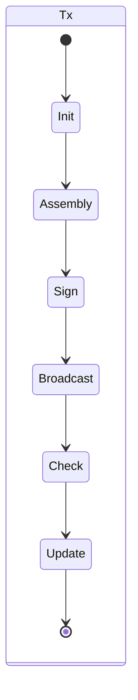

# HuiCollect

## 项目背景

本项目配合爬快服务，爬快服务监控指定的to地址交易作为初始，然后组装交易，调用签名服务，然后广播发送出去，根据结果更新账本。

## 项目设计

爬快监控到to地址的交易插入db中数据，设计一个状态机，从插入交易作为初始状态，到组装，签名，广播，更新账本。

状态说明：
  - 监控到to交易，插入db中一条记录，状态为Init
  - 组装交易，完毕后状态为Assembly：查看这里的from地址是否有钱，如果有足够支付一笔转账交易21000（21000*2Gwei = 0.4*10-4），那么直接构造归集交易（状态直接为Assembly，表示组装完毕），否则，那么先构造一笔打钱交易
  - 调用签名接口，完毕后状态为Sign
  - 广播发送，完毕后状态为Broadcast
  - 查询收据，确认交易完成
  - 确认结果上链后，如果是打钱交易，则直接插入一条归集交易init，如果是归集交易，则直接更新账本

   

