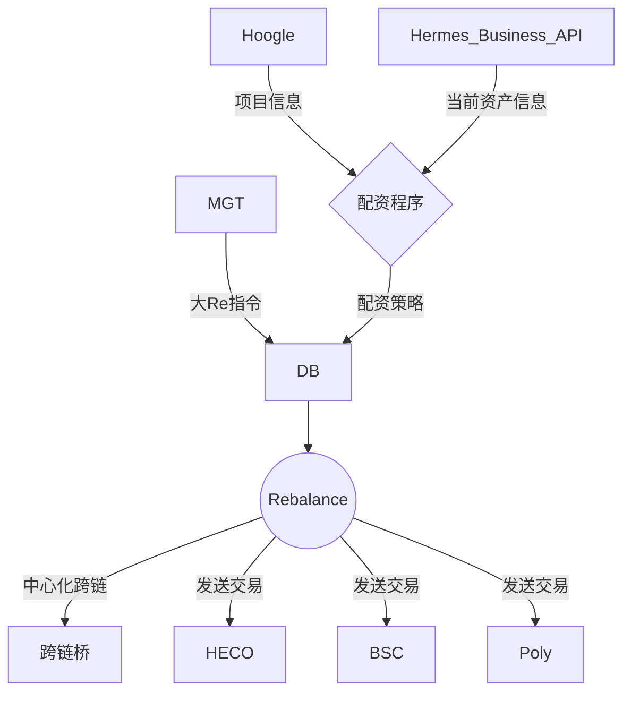
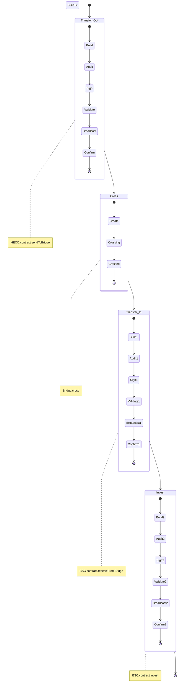

# hermes rebalance

## 项目背景

rebalance的主要作用是为机枪池业务服务，用于根据指令平衡个链之间的资产分布。整体的产品框架图如下

整体的rebalance项目实际上海包括配资部分，负责配资计算，这个是单独的脚本项目，会有单独的文档详细叙述，这里只讲解rebalance的执行部分。即此项目的主要功能和流程。

## 项目设计

项目的主要功能就是按照配资计算结果，或mgt指令，将不同链上的资产进行迁移，其中分为小Re和大Re两种场景。

### 小Re

以 HECO --> BSC 的操作为例，上图为小Re的状态转移图。无论大re，小re，都是以状态机模型进行设计的， 原因有以下几点：
rebalance的操作都是异步的，操作非原子的。通过将rebalance操作分解为不同的状态，可以确定每个状态下的程序行为，并且每个状态的行为都可以分解成原子的、事务性的、可重试的。这样就保证了每一步的操作都是由有成功保障的。

状态说明：
+ Transfer_Out. 将机枪池的资金从指定合约内转出到跨链桥的起点地址上
  > 其他链上操作与此相同，不一一赘述了
  - 根据实际情况，构造交易
  - 调用审计接口，对交易信息进行审计
  - 调用签名机进行签名操作
  - 签名完成后，调用validator接口对数据进行校验，并将签名信息解密
  - 广播交易
  - 等待交易达到确认次数后，确认交易完成
+ Cross. 调用跨链桥接口，将资金从From链跨到指定链上，资金最终到达跨链桥终点地址上
+ Transfer_In. 将资金从跨链桥地址转入到机枪池的合约地址内
+ Invest. 根据参数，对机枪池资产进行投资，调用指定合约

   

