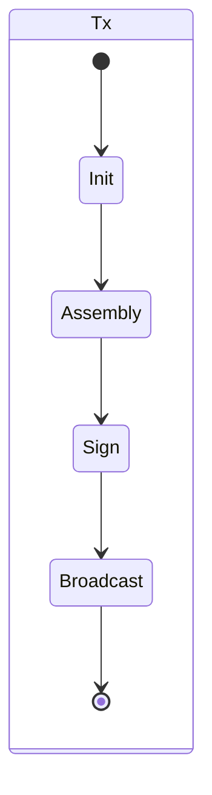

# Hui-TxState

## 项目背景

本项目接收从注册而来的信息作为初始状态，然后组装交易，调用签名服务，然后广播发送出去。

## 项目设计

从注册开始插入db中数据，设计一个状态机，从注册作为初始状态，到组装，签名，广播。

go route不断的扫，执行。

状态说明：
  - 初始注册，插入db中一条记录，状态为Inited
  - 组装交易，完毕后状态为Assembled
  - 调用签名接口，完毕后状态为Signed
  - 广播发送，完毕后状态为Broadcasted
  - 等待交易达到确认次数后，确认交易完成

   

